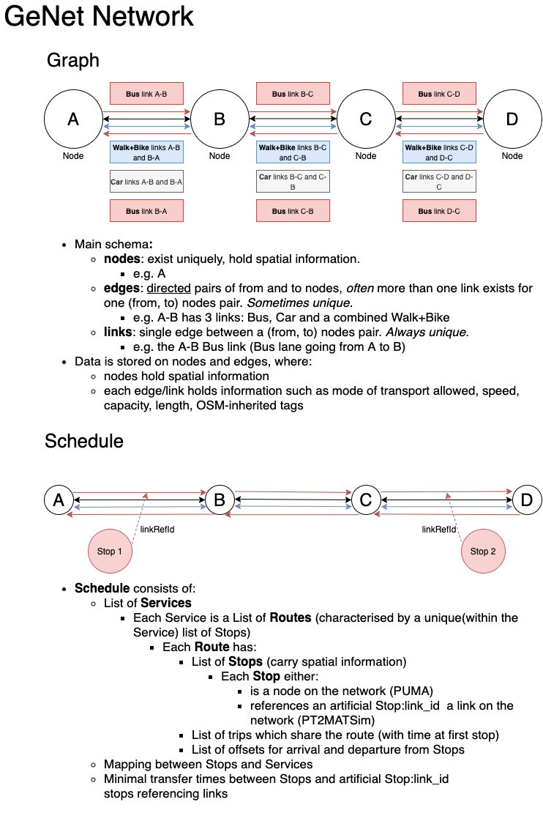

# Network Scenario Generator (GeNet)

This package provides tools to represent and work with a multi-modal transport network with public transport (PT)
services. It is based on [MATSim's](https://www.matsim.org/) representation of such networks. The underlying 
network available to PT services (roads, railways, but also ferry/flight connections) uses a `networkx.MultiDiGraph`
with additional methods for `'links'` which are unique in `genet.Network` (`networkx.MultiDiGraph` accepts multiple 
edges between the same from and to node pair; referring to an edge in `networkx.MultiDiGraph` and `genet.Network`
has the same effects, i.e. the result is a dictionary indexed by the multi edge index). The PT services are 
represented through `genet.Schedule` class which relies on other `genet` 
classes: the `Schedule` relies on a list of `genet.Service`'s, which in turns consists of a list of `genet.Route`'s.
Each `Route` class object has an attribute `stops` which consists of `genet.Stops` objects. The `Stops` carry spatial
information for the PT stop.

The goal of GeNet is to:
- Provide a formalised in-memory data structure for representing a multi-modal network with a PT service
- Enable using the data structure for tasks such as generating auxiliary MATSim files e.g. Road Pricing
- Simplify the process of modifying a network and provide simple change log to track the differences between the input
and output networks.
- Provide validation methods to check for simple errors such as: whether a `Route` has more than one `Stop` or that the
underlying graph doesn't have any dead-ends or sources (a place which you can leave but cannot get back to).

## Setup

#### Install dev prereqs (use equivalent linux or windows package management)

    brew install python3.7
    brew install virtualenv
    
#### Installation  

    virtualenv -p python3.7 venv
    source venv/bin/activate
    pip install -r requirements.txt
    pip install -e .
    
### Testing

#### Run the unit tests (from root dir)

    python -m pytest -vv tests

#### Generate a unit test code coverage report

To generate XML & HTML coverage reports to `reports/coverage`:
    
    ./scripts/code-coverage.sh

## Usage
This section goes through basic usage examples.

### Setting-up a Network object

Instantiate an empty network

    >>> import genet
    >>> n = genet.Network()
    >>> n
    
    <Network instance at 4683796240: with 
    graph: Name: 
    Type: MultiDiGraph
    Number of nodes: 0
    Number of edges: 0
     and 
    schedule Number of services: 0
    Number of unique routes: 0

You can now use methods to read in MATSim network files:

    >>> pt2matsim_network = 'path/to/network.xml'
    >>> pt2matsim_schedule = 'path/to/schedule.xml'
    
    >>> n.read_matsim_network(pt2matsim_network, epsg='epsg:27700')
    >>> n.read_matsim_schedule(pt2matsim_schedule, epsg='epsg:27700')
    >>> n
    
    <Network instance at 4683796240: with 
    graph: Name: 
    Type: MultiDiGraph
    Number of nodes: 1662
    Number of edges: 3166
    Average in degree:   1.9049
    Average out degree:   1.9049 and 
    schedule Number of services: 62
    Number of unique routes: 520
    

### Using a Network object

Once you have a `genet.Network` object, you can use it to produce auxiliary files, analyse of modify the network.

#### Summary
The data saved on the edges of the graph can be nested. There are a couple of convenient methods that summarise the 
schema of the data found on the nodes and links to show you what the keys (and if `data=True`, also values) of those 
dictionaries look like. If `data=True`, the output shows up to 5 unique values stored in that location.

    >>> n.node_attribute_summary(data=True)
    
    attribute
    ├── id: ['293813458', '4582907654', '107829', '2833956947', '5607749654']
    ├── x: ['527677.5109120146', '529801.0659699676', '530238.1178740165', '527959.3321330055', '530629.5558489189']
    ├── y: ['181250.1252480651', '182424.5440813937', '181228.56259440206', '182169.2831176619', '181516.2234405568']
    ├── lon: [-0.15178558709839862, -0.15872448710537235, -0.13569068709168342, -0.13766218709633904, -0.13543658708819173]
    ├── lat: [51.51609983324067, 51.5182034332405, 51.51504733324089, 51.522253033239515, 51.522948433239556]
    └── s2_id: [5221390710015643649, 5221390314367946753, 5221366508477440003, 5221390682291777543, 5221390739236081673]

and for links,

    >>> n.link_attribute_summary()
    
    attribute
    ├── id
    ├── from
    ├── to
    ├── freespeed
    ├── capacity
    ├── permlanes
    ├── oneway
    ├── modes
    ├── s2_from
    ├── s2_to
    ├── length
    └── attributes
        ├── osm:way:access
        │   ├── name
        │   ├── class
        │   └── text
        ├── osm:way:highway
        │   ├── name
        │   ├── class
        │   └── text
        ├── osm:way:id
        │   ├── name
        │   ├── class
        │   └── text
        ├── osm:way:name
        │   ├── name
        │   ├── class
        │   └── text
        ...
        └── osm:way:service
            ├── name
            ├── class
            └── text

Once you see the general schema for the data stored on nodes and links, you may decide to look at or perform analysis 
on all of the data stored in the network under a particular key. A GeNet network has four methods (two for nodes and 
two for links) which generate:

- `pandas.Series` object, which stores the nodes or links data present at the specified key, indexed by the same index 
as the nodes or links.
- or `pandas.DatFrame` object if you want to exctract data under more than one key, indexed by the same index 
as the nodes or links.

For example:

    >>> s_freespeed = n.link_attribute_data_under_key('freespeed')
    >>> s_freespeed
    1                4.166667
    10               4.166667
    100              4.166667
    1000             4.166667
    1001             4.166667
                      ...    
    998              6.944444
    999              6.944444
    pt_1383_2634     5.000000
    pt_1383_3328    10.000000
    pt_1506_1663     5.000000
    Length: 3166, dtype: float64

then you can treat it as a `pandas` object and use their methods to analyse it, e.g.
    
    >>> s_freespeed.describe()
    count    3166.000000
    mean        9.522794
    std         7.723735
    min         2.777778
    25%         4.166667
    50%         4.166667
    75%        22.222222
    max        22.222222
    dtype: float64
    
And for more keys:

    >>> n.link_attribute_data_under_keys(['freespeed', {'attributes': {'osm:way:highway': 'text'}}]).head()

    |      |   freespeed | attributes::osm:way:highway::text   |
    |-----:|------------:|:------------------------------------|
    |    1 |     4.16667 | unclassified                        |
    |   10 |     4.16667 | unclassified                        |
    |  100 |     4.16667 | unclassified                        |
    | 1000 |     4.16667 | residential                         |
    | 1001 |     4.16667 | residential                         |

#### Extracting links of interest

You can extract the unique ids of links in the network which satisfy certain conditions pertaining to the
data being stored on graph edges.

    >>> links = genet.graph_operations.extract_links_on_edge_attributes(
            n,
            conditions= {'attributes': {'osm:way:highway': {'text': 'primary'}}},
        )
    >>> links[:5]
    ['1007', '1008', '1023', '1024', '103']

The function above gathers link ids which satisfy conditions 
to arbitrary level of nested-ness. It also allows quite flexible conditions---above we require that the link value
at `data['attributes']['osm:way:highway']['text'] == 'primary'`, where data is the data dictionary stored on that link.
You can also define a condition such that `data['attributes']['osm:way:highway']['text']` is one of the items in a 
list: `['primary', 'secondary', 'something else']`:

    >>> links = genet.graph_operations.extract_links_on_edge_attributes(
            n,
            conditions= {'attributes': {'osm:way:highway': {'text': ['primary', 'secondary', 'something else']}}},
        )

and many more. You can find the examples in the jupyter notebook: `notebooks/GeNet walk-through.ipynb`

### Modifying a Network object

`GeNet` supports some simple modifications like adding, reindexing and removing nodes and links and some involved 
modifications like changing the data stored under nodes or links (which will be discussed below). All of these 
changes get recorded in `n.change_log`.

#### 1.) Adding nodes/links

    >>> n.add_link(link_id='proposed_index', u='4356572310', v='5811263955')
    >>> n.add_node(node='proposed_index', attribs={'data':'some_data'})

The index passed is only a proposition. If a node or link under this link exists, a new, unique index will be 
generated.

#### 2.) Reindexing

To reindex a node or link:

    >>> n.reindex_node('proposed_index', 'another_index')
    >>> n.reindex_link('proposed_index', 'another_index')

#### 3.) Removing nodes/links

To remove a link or node:

    >>> n.remove_links('another_index')
    >>> n.remove_node('another_index')

#### 4.) Modifying data stored on nodes or edges:

Let's say you have extracted `genet.Network` link ids of interest, they are stored in the list `links` as above, and 
now you want to make changes to the network. Let's 
make changes to the nested OSM data stored on the links. We will replace the highway tags from to 
`'SOMETHING'`.

    >>> n.apply_attributes_to_links(links, {'attributes': {'osm:way:highway': {'text': 'SOMETHING'}}})
    
    >>> n.link('1007')
    
    {'id': '1007',
     'from': '4356572310',
     'to': '5811263955',
     'freespeed': 22.22222222222222,
     'capacity': 3000.0,
     'permlanes': 2.0,
     'oneway': '1',
     'modes': ['car'],
     's2_from': 5221390723045407809,
     's2_to': 5221390723040504387,
     'length': 13.941905154249884,
     'attributes': {'osm:way:highway': {'name': 'osm:way:highway',
       'class': 'java.lang.String',
       'text': 'SOMETHING'},
      'osm:way:id': {'name': 'osm:way:id',
       'class': 'java.lang.Long',
       'text': '589660342'},
      'osm:way:lanes': {'name': 'osm:way:lanes',
       'class': 'java.lang.String',
       'text': '2'},
      'osm:way:name': {'name': 'osm:way:name',
       'class': 'java.lang.String',
       'text': 'Shaftesbury Avenue'},
      'osm:way:oneway': {'name': 'osm:way:oneway',
       'class': 'java.lang.String',
       'text': 'yes'}}}

The changes you make to the `Network` will be recorded in the `change_log` which is a `pandas.DataFrame`. This log
gets saved to a csv together with any `Network` outputs.

    >>> n.change_log.log
    
    |    | timestamp           | change_event   | object_type   |   old_id |   new_id | old_attributes                                                                                                                                                                                                                                                                                                                                                                                                                                                                                                                                                                                                                                                                                                                                                          | new_attributes                                                                                                                                                                                                                                                                                                                                                                                                                                                                                                                                                                                                                                                                                                                                                            | diff                                                                      |
    |---:|:--------------------|:---------------|:--------------|---------:|---------:|:------------------------------------------------------------------------------------------------------------------------------------------------------------------------------------------------------------------------------------------------------------------------------------------------------------------------------------------------------------------------------------------------------------------------------------------------------------------------------------------------------------------------------------------------------------------------------------------------------------------------------------------------------------------------------------------------------------------------------------------------------------------------|:--------------------------------------------------------------------------------------------------------------------------------------------------------------------------------------------------------------------------------------------------------------------------------------------------------------------------------------------------------------------------------------------------------------------------------------------------------------------------------------------------------------------------------------------------------------------------------------------------------------------------------------------------------------------------------------------------------------------------------------------------------------------------|:--------------------------------------------------------------------------|
    |  0 | 2020-06-02 10:47:03 | modify         | link          |     1007 |     1007 | {'id': '1007', 'from': '4356572310', 'to': '5811263955', 'freespeed': 22.22222222222222, 'capacity': 3000.0, 'permlanes': 2.0, 'oneway': '1', 'modes': ['car'], 's2_from': 5221390723045407809, 's2_to': 5221390723040504387, 'length': 13.941905154249884, 'attributes': {'osm:way:highway': {'name': 'osm:way:highway', 'class': 'java.lang.String', 'text': 'primary'}, 'osm:way:id': {'name': 'osm:way:id', 'class': 'java.lang.Long', 'text': '589660342'}, 'osm:way:lanes': {'name': 'osm:way:lanes', 'class': 'java.lang.String', 'text': '2'}, 'osm:way:name': {'name': 'osm:way:name', 'class': 'java.lang.String', 'text': 'Shaftesbury Avenue'}, 'osm:way:oneway': {'name': 'osm:way:oneway', 'class': 'java.lang.String', 'text': 'yes'}}}                  | {'id': '1007', 'from': '4356572310', 'to': '5811263955', 'freespeed': 22.22222222222222, 'capacity': 3000.0, 'permlanes': 2.0, 'oneway': '1', 'modes': ['car'], 's2_from': 5221390723045407809, 's2_to': 5221390723040504387, 'length': 13.941905154249884, 'attributes': {'osm:way:highway': {'name': 'osm:way:highway', 'class': 'java.lang.String', 'text': 'SOMETHING'}, 'osm:way:id': {'name': 'osm:way:id', 'class': 'java.lang.Long', 'text': '589660342'}, 'osm:way:lanes': {'name': 'osm:way:lanes', 'class': 'java.lang.String', 'text': '2'}, 'osm:way:name': {'name': 'osm:way:name', 'class': 'java.lang.String', 'text': 'Shaftesbury Avenue'}, 'osm:way:oneway': {'name': 'osm:way:oneway', 'class': 'java.lang.String', 'text': 'yes'}}}                  | [('change', 'attributes.osm:way:highway.text', ('primary', 'SOMETHING'))] |
    |  1 | 2020-06-02 10:47:03 | modify         | link          |     1008 |     1008 | {'id': '1008', 'from': '5811263955', 'to': '21665588', 'freespeed': 22.22222222222222, 'capacity': 3000.0, 'permlanes': 2.0, 'oneway': '1', 'modes': ['car'], 's2_from': 5221390723040504387, 's2_to': 5221390723204000715, 'length': 25.86037080854938, 'attributes': {'osm:way:highway': {'name': 'osm:way:highway', 'class': 'java.lang.String', 'text': 'primary'}, 'osm:way:id': {'name': 'osm:way:id', 'class': 'java.lang.Long', 'text': '614324183'}, 'osm:way:lanes': {'name': 'osm:way:lanes', 'class': 'java.lang.String', 'text': '2'}, 'osm:way:name': {'name': 'osm:way:name', 'class': 'java.lang.String', 'text': 'Shaftesbury Avenue'}, 'osm:way:oneway': {'name': 'osm:way:oneway', 'class': 'java.lang.String', 'text': 'yes'}}}                     | {'id': '1008', 'from': '5811263955', 'to': '21665588', 'freespeed': 22.22222222222222, 'capacity': 3000.0, 'permlanes': 2.0, 'oneway': '1', 'modes': ['car'], 's2_from': 5221390723040504387, 's2_to': 5221390723204000715, 'length': 25.86037080854938, 'attributes': {'osm:way:highway': {'name': 'osm:way:highway', 'class': 'java.lang.String', 'text': 'SOMETHING'}, 'osm:way:id': {'name': 'osm:way:id', 'class': 'java.lang.Long', 'text': '614324183'}, 'osm:way:lanes': {'name': 'osm:way:lanes', 'class': 'java.lang.String', 'text': '2'}, 'osm:way:name': {'name': 'osm:way:name', 'class': 'java.lang.String', 'text': 'Shaftesbury Avenue'}, 'osm:way:oneway': {'name': 'osm:way:oneway', 'class': 'java.lang.String', 'text': 'yes'}}}                     | [('change', 'attributes.osm:way:highway.text', ('primary', 'SOMETHING'))] |
    |  2 | 2020-06-02 10:47:03 | modify         | link          |     1023 |     1023 | {'id': '1023', 'from': '1611125463', 'to': '108234', 'freespeed': 22.22222222222222, 'capacity': 3000.0, 'permlanes': 2.0, 'oneway': '1', 'modes': ['bus', 'car', 'pt'], 's2_from': 5221390319884366911, 's2_to': 5221390320040783993, 'length': 53.767011109096586, 'attributes': {'osm:relation:route': {'name': 'osm:relation:route', 'class': 'java.lang.String', 'text': 'bus'}, 'osm:way:highway': {'name': 'osm:way:highway', 'class': 'java.lang.String', 'text': 'primary'}, 'osm:way:id': {'name': 'osm:way:id', 'class': 'java.lang.Long', 'text': '59718434'}, 'osm:way:name': {'name': 'osm:way:name', 'class': 'java.lang.String', 'text': 'Cavendish Place'}, 'osm:way:oneway': {'name': 'osm:way:oneway', 'class': 'java.lang.String', 'text': 'yes'}}} | {'id': '1023', 'from': '1611125463', 'to': '108234', 'freespeed': 22.22222222222222, 'capacity': 3000.0, 'permlanes': 2.0, 'oneway': '1', 'modes': ['bus', 'car', 'pt'], 's2_from': 5221390319884366911, 's2_to': 5221390320040783993, 'length': 53.767011109096586, 'attributes': {'osm:relation:route': {'name': 'osm:relation:route', 'class': 'java.lang.String', 'text': 'bus'}, 'osm:way:highway': {'name': 'osm:way:highway', 'class': 'java.lang.String', 'text': 'SOMETHING'}, 'osm:way:id': {'name': 'osm:way:id', 'class': 'java.lang.Long', 'text': '59718434'}, 'osm:way:name': {'name': 'osm:way:name', 'class': 'java.lang.String', 'text': 'Cavendish Place'}, 'osm:way:oneway': {'name': 'osm:way:oneway', 'class': 'java.lang.String', 'text': 'yes'}}} | [('change', 'attributes.osm:way:highway.text', ('primary', 'SOMETHING'))] |

## Validation

### MATSim specific validation

You can generate a validation report for the genet Network encompassing validity of the network, schedule and routing
 (of the transit services in the schedule on the network). It aims to provide a good collection of checks known to have
 affected MatSim simulations in the past.
 
    >>> report = n.generate_validation_report()

The report is a simple dictionary with keys: `graph`, `schedule` and `routing`.

The `graph` section describes strongly connected components of the modal subgraphs, for modes that agents in MATSim
need to find routes on: `car`, and `walk` and `bike` if using the `multimodal.contrib`. In addition to this, it also
flags links of length 1km or longer that can be inspected separately.

    'graph': {'graph_connectivity': {'bike': {'number_of_connected_subgraphs': 1,
                                              'problem_nodes': {'dead_ends': [],
                                                                'unreachable_node': []}},
                                     'car': {'number_of_connected_subgraphs': 1,
                                              'problem_nodes': {'dead_ends': [],
                                                                'unreachable_node': []}},
                                     'walk': {'number_of_connected_subgraphs': 1,
                                              'problem_nodes': {'dead_ends': [],
                                                                'unreachable_node': []}}},
              'links_over_1km_length': []}

The `schedule` section describes correctness of the schedule on three levels:
    
- `schedule_level`: Overall look at the schedule validity. A `Schedule` is valid if:
    - all of its' services are valid
    - its' services are uniquely indexed
    
    Schedule `has_valid_services` if all services within the schedule are deemed valid. The invalid services are 
    flagged in `invalid_services` and the invalid stages of schedule validity are flagged in `invalid_stages`.
- `service_level`: Provides a look at validity of services within the schedule. It is indexed by service ids. Each
`Service` is valid if:
    - each of its' routes is valid
    - its' routes are uniquely indexed
    
    A service `has_valid_routes` if all routes within the service are deemed valid. The invalid routes are 
    flagged in `invalid_routes` and the invalid stages of service validity are flagged in `invalid_stages`.
- `route_level`: Provides a look at validity of each route within each service indexed by service id and route id
(or service id and the index in the `Service.routes` list if not uniquely indexed). Each `Route` is valid if it
    - has more than one `Stop`
    - has correctly ordered route (the stops (their link reference ids) and links a route refers to are in the same 
    order)
    - arrival and departure offsets are correct (each stop has one and they are correctly ordered temporally)
    - does not have self loops (there are no trips such as: Stop A -> Stop A)
    
    If a route satisfies the above `is_valid_route` is `True`. If not, the `invalid_stages` flag where the route
    did not satisfy validity conditions.

(Nb. The same dictionary can be generated by using `Schedule` object's own `generate_validation_report` method.)

    'schedule': {
     'schedule_level': {'has_valid_services': False,
                        'invalid_services': ['10314'],
                        'invalid_stages': ['not_has_valid_services'],
                        'is_valid_schedule': False},
     'service_level': {'10314': {'has_valid_routes': False,
                                 'invalid_routes': ['VJbd8660f05fe6f744e58a66ae12bd66acbca88b98',
                                                    'VJ042669cc08161b30efa3b508346b648613a95047'],
                                 'invalid_stages': ['not_has_valid_routes'],
                                 'is_valid_service': False},
                       '12430': {'has_valid_routes': True,
                                 'invalid_routes': [],
                                 'invalid_stages': [],
                                 'is_valid_service': True}},
     'route_level': {'10314': {'VJ042669cc08161b30efa3b508346b648613a95047': {'invalid_stages': ['not_has_correctly_ordered_route'],
                                                                              'is_valid_route': False},
                               'VJ37e93a6ebc1f8b2be99e4279776413113b7ce4c5': {'invalid_stages': [],
                                                                              'is_valid_route': True},
                               'VJbd8660f05fe6f744e58a66ae12bd66acbca88b98': {'invalid_stages': ['not_has_more_than_one_stop',
                                                                                                 'not_has_correctly_ordered_route',
                                                                                                 'not_has_valid_offsets'],
                                                                              'is_valid_route': False}},
                     '12430': {'VJ06420fdab0dfe5c8e7f2f9504df05cf6289cd7d3': {'invalid_stages': [],
                                                                              'is_valid_route': True},
                               'VJ06cd41dcd58d947097df4a8f33234ef423210154': {'invalid_stages': [],
                                                                              'is_valid_route': True}}}
     }

Finally, the `routing` section describes routing of the transit schedule services onto the network graph.
- `services_have_routes_in_the_graph`: all routes have network routes and the links they refer to exist in the graph,
are connected (to nodes of preceding link is the from node of the next link in the chain) and the `modes` saved on the
link data accept the mode of the route.
- `service_routes_with_invalid_network_route`: flags routes not satifying the above,
- `route_to_crow_fly_ratio`: gives ratio of the length of route to crow-fly distance between each of the stops along 
route. If the route is invalid, it will result in 0. If the route has only one stop it will result in 
`'Division by zero'`.

Example:

    'routing': {
      'services_have_routes_in_the_graph': False,
      'service_routes_with_invalid_network_route': [('10314', 'VJbd8660f05fe6f744e58a66ae12bd66acbca88b98'),
                                                    ('10314', 'VJc1917d79cd0c4f5f42519e362770d125c9f209c6'),
                                                    ('10314', 'VJ042669cc08161b30efa3b508346b648613a95047')],
      'route_to_crow_fly_ratio': {'10314': {'VJ042669cc08161b30efa3b508346b648613a95047': 0.0,
                                            'VJ37e93a6ebc1f8b2be99e4279776413113b7ce4c5': 0.9364835737183665,
                                            'VJ77530340dfe6e2a540002a6c7c283879d708dec6': 0.0,
                                            'VJbd8660f05fe6f744e58a66ae12bd66acbca88b98': 'Division by zero',
                                            'VJc1917d79cd0c4f5f42519e362770d125c9f209c6': 0.0,
                                            'VJfd74b67b9801ab3010f64fd130ec9ef9062470d3': 0.9364835737183665},
                                  '12430': {'VJ06420fdab0dfe5c8e7f2f9504df05cf6289cd7d3': 1.3239965103249995,
                                            'VJ06cd41dcd58d947097df4a8f33234ef423210154': 1.3239965103249995}}
     }

Something that is not included in the validity report (because MATSim doesn't insist on it being satified) is strong 
connectivity of PT. You can call `is_strongly_connected` on `Schedule` or the schedule components: `Service` and 
`Route`. The process builds a directed graph of stop connections (which you can build for inspection using 
`build_graph` on, again, `Schedule` or the schedule components: `Service` and `Route`).

    >>> n.schedule.is_strongly_connected()
    False
    >>> n.schedule.build_graph()
    <networkx.classes.digraph.DiGraph at 0x11d995750>

### Using Google Directions API for speed calculation

You can generate and send google directions API requests based on the network. The process will create a 'car' modal
subgraph and generate API requests for all edges in the subgraph. The number of requests is at most the number of edges
in the subgraph. The process simplifies edges using `osmnx` library's method to extract a chains of nodes with no
intersections, in this way reducing the number of requests. If your graph is already simplified, the number of requests
will be equal to the number of edges.
 You need to specify an upper bound for the number of requests you're happy to send, big networks 
generate many requests (even with the simplification) and you will be charged per request. You can generate
the requests first and inspect them before committing to running them.

    >>> api_requests = gn.google_directions.generate_requests(n=n)
    >>> len(api_requests)
    12345

To send requests to Google Direction API you need a key [(read more here)](https://developers.google.com/maps/documentation/directions/start).
After obtaining a key, you can:
 - pass it to the relevant function under `key` variable
 - set it as an environmental variable called `GOOGLE_DIR_API_KEY`
 - use AWS `Secrets Manager` [(read more here)](https://aws.amazon.com/secrets-manager/)
 
If passing the key directly to the function:

    >>> api_requests = gn.google_directions.send_requests_for_network(
            n=n, 
            key='google_directions_api_key',
            output_dir='../example_data/example_google_speed_data',
            traffic=True
        )

To set it as an environmental variable called `GOOGLE_DIR_API_KEY`, using command line:
    
    $ export GOOGLE_DIR_API_KEY='key'
    
    >>> api_requests = gn.google_directions.send_requests_for_network(
            n=n, 
            output_dir='../example_data/example_google_speed_data',
            traffic=True
        )

If you using AWS `Secrets Manager`, authenticate to your AWS account and then pass the `secret_name` and `region_name` 
to the `send_requests_for_network` 
method:

    >>> api_requests = gn.google_directions.send_requests_for_network(
            n=n, 
            output_dir='../example_data/example_google_speed_data',
            traffic=True,
            secret_name='secret_name', 
            region_name='region_name'
        )

This method will save derived results in the output directory provided, an example can be found here: 
`../example_data/example_google_speed_data`. It comprises of the google polyline of the response and speed derived from
distance and time taken to travel as well as information that was generated in order to make the response such as
the node ids in the network for which this response holds, the `path_nodes` which denote any extra nodes from the non
simplified chain of nodes/edges in the request, the polyline of the network path, encoded using the same polyline 
encoding as the Google request polyline; as well as spatial information about the origin and destination of the request
and timestamp.

You can read saved results:

    >>> api_requests = gn.google_directions.read_saved_api_results('../example_data/example_google_speed_data')

Once you have results, you can match them to the network:

    >>> google_edge_data = gn.google_directions.map_results_to_edges(api_requests)

This will create a dictionary of non-simplified edges to which the response data applies. This data can be applied to
the graph in the following way:

    >>> def modal_condition(value):
    >>>     return 'car' in value
    >>> _n.apply_attributes_to_edges(google_edge_data, conditions={'modes': modal_condition})
    
Resulting in two new data points in the relevant links: `google_speed` and `google_polyline`. You can compute
differences in speeds using:

    >>> def speed_difference(link_attribs):
            return link_attribs['freespeed'] - link_attribs['google_speed']
    
    >>> _n.apply_function_to_links(speed_difference, 'speed_difference')

Resulting in a new data point in the relevant links: `speed_difference`.

You can also choose to set google speed as the `freespeed` in the network. But be mindful if you use it for MATSim
simulations, `freespeed` denotes the maximum speed a vehicle can travel on a certain link, Google Directions API data
with `traffic=True` should be ran late at night/early morning ~4am local time to the network for any reliable results.
Otherwise you are adding traffic conditions to the network which should be simulated by demand (population) side of 
the model rather than supply (network).

    >>> def set_google_speed(link_attribs):
            return link_attribs['google_speed']
    
    >>> _n.apply_function_to_links(set_google_speed, 'freespeed')

### Routing

You can find shortest path between two nodes in the graph, using a modal subgraph or otherwise.

    >>> n.find_shortest_path(from_node, to_node)

will use the whole graph disregarding modes.

    >>> n.find_shortest_path(from_node, to_node, modes='car')

will compute a modal subgraph and use it for routing. You can also pass a list e.g. `['bike`, `walk`]`. 
If you have many node pair to process, it may be beneficial to
compute the modal subgraph of interest first and pass it to the method

    >>> car_g = n.modal_subgraph('car')
    >>> n.find_shortest_path(from_node, to_node, subgraph=car_g)

Specifying `'modes'` on top of giving the `subgraph` will also use given modes for preferential treatment if there is
ambiguity in which link should be chosen for the route (remember, there can be several links between the same two 
nodes). For example, if using mode `'bus'` and there are two links to choose from, one with modes: `['car', 'bus']` and
the other with just `['bus']`, preference will be given to the link dedicated to that mode. Otherwise, preference
will be given to links with higher `freespeed`.

You can also choose to return the chain of nodes instead:

    >>> n.find_shortest_path(from_node, to_node, return_nodes=True)

## Adding two networks

You can add one network to another. The network you're adding the other network too will be updated with the nodes, 
link and data from the other network. Before the network you are adding will go through a process of having it's node
and link indices consolidated to match the network it's being added to. The node ids are consolidated based on their
spatial information, i.e. the network-to-add will inherit the node ids from the main network if the nodes share the
`s2` index. The link ids and the multi index the edge is stored under in the graph are consolidated based on shared 
from and to nodes and modes and the modes stored in the links data.

For now, the method only supports non overlapping services.

    >>> n.add(other_network)

### Writing results

At the moment GeNet supports saving `Network` and `Schedule` objects to MATSim's `network.xml`, `schedule.xml` and
`vehicles.xml`.

    >>> n.write_to_matsim('/path/to/matsim/networks/genet_output'))
    
Saving a `Network` will result in `network.xml`, `schedule.xml` and `vehicles.xml` files if the Network has a non-empty 
`Schedule`.

Saving a `Schedule` will result in `schedule.xml` and `vehicles.xml` files.

You can check that a `Network` that had been read in from MATSim files results in semantically equal xml files 
(if not changes were applied to the `Network` of course)

    >>> from tests.xml_diff import assert_semantically_equal
    >>> assert_semantically_equal(
            pt2matsim_schedule, 
            '/path/to/matsim/networks/genet_output/schedule.xml')
            
            
    path/to/schedule.xml and /path/to/matsim/networks/genet_output/schedule.xml are semantically equal